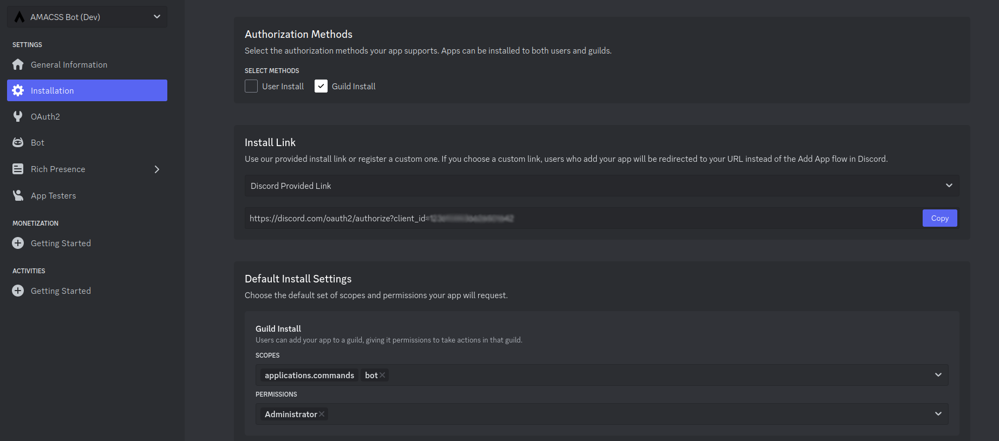
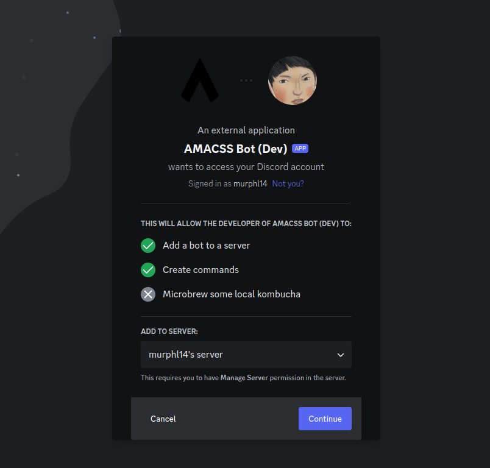
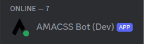

## Discord Developer Portal

(1) Navigate to the <a href="https://discord.com/developers/applications">Discord Developer Portal</a> and authenticate using your Discord credentials.

(2) On the Applications dashboard page, click `New Application` and give a name of your choice:


(3) Navigate to the `Bot` tab, and in the token section, click `Reset Token`. You should see a new token:


(4) Copy the token and store it for future use.

(5) On the `Bot` tab, make sure all of the `Privileged Gateway Intents` are enabled as shown:


## Adding Bot To Local Server

To test out our new features, we will want to create our own server so we can add the local copy of the bot we created:

(1) Make a Discord server

(2) On the <a href="https://discord.com/developers/applications">Discord Developer Portal</a>, get the installation link and set the install settings as follows:



(3) Paste the install link into a browser, and add it to your server:



(4) If you completed "(6) Run the Bot" from the previous section, the bot should appear to be online in your server:



Now you can try out the bots commands and test your own creations!


## Running this Project

(1) Create a virtual environment:

```
python -m venv venv
```

Note 1: If "python" doesn't work for the command above, try "python3"

(2) Activate your venv:

```
source venv/bin/activate
```

Note: For windows devices, the command might differ. You typically just enter the path of the `activate` script that is within your `venv` folder. For me, it's:

```
./venv/bin/activate     # I've also seen ./venv/Scripts/activate
```

(3) Install necessary packages:

```
pip install -r deps.txt
```

Note: If "pip" doesn't work for the command above, try "pip3"

(4) Run the bot:

```
python main.py
```

You should see an output command similar to the following (the bot name may differ):

```
We have logged in as AMACSS Bot (Dev)#3613
```